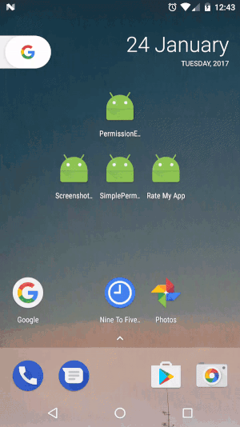
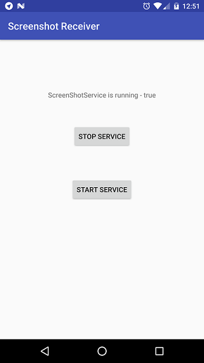
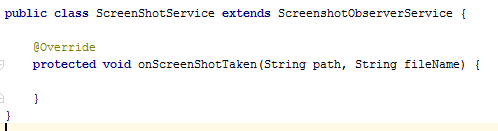

# Screenshot-observer
This library will help you to receive android `screenshot events.



The current minSDK version is API level 15.

-----------------------


## Download sample [apk][1]
[1]: https://github.com/armcha/Screenshot-observer/raw/master/screens/Screenshot-observer-sample.apk
-----------------------

##Download

Gradle:
```groovy
compile 'com.github.armcha:Screenshot-observer:1.1.0'
```

## Setup and usage
-----------------------

Step 1.
Create service and extend it from ```ScreenshotObserverService``` and override ```onScreenShotTaken``` method



Step 2.
Start your service from Activity
```startService(new Intent(this, ScreenShotService.class));```

###Note:
For API 23 and higher you should grant READ_EXTERNAL_STORAGE permission and
there is still some issue while editing the screenshot file

## Contact
-----------------------

Pull requests are more than welcome.
Please fell free to contact me if there is any problem when using the library.

- **Email**: armcha01@gmail.com
- **Facebook**: https://web.facebook.com/chatikyana
- **Google +**: https://plus.google.com/112011638040018774140
- **Website**: http://luseen.com/
- **Twitter**: http://twitter.com/@ArmanChatikyan


License
--------


      Screenshot-observer library for Android
      Copyright (c) 2017 Arman Chatikyan (https://github.com/armcha/Screenshot-observer).

      Licensed under the Apache License, Version 2.0 (the "License");
      you may not use this file except in compliance with the License.
      You may obtain a copy of the License at

         http://www.apache.org/licenses/LICENSE-2.0

      Unless required by applicable law or agreed to in writing, software
      distributed under the License is distributed on an "AS IS" BASIS,
      WITHOUT WARRANTIES OR CONDITIONS OF ANY KIND, either express or implied.
      See the License for the specific language governing permissions and
      limitations under the License.


